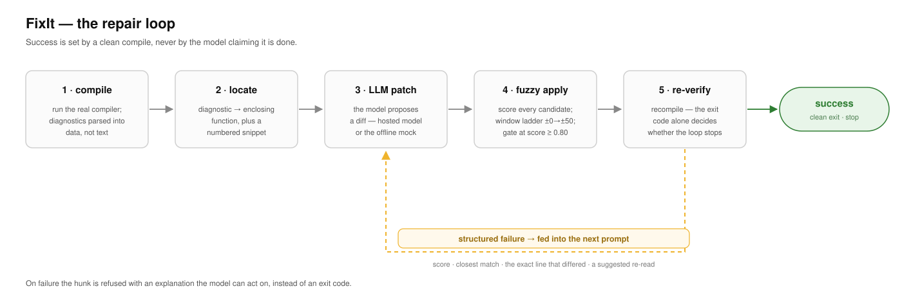
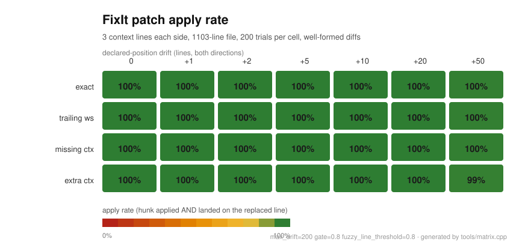
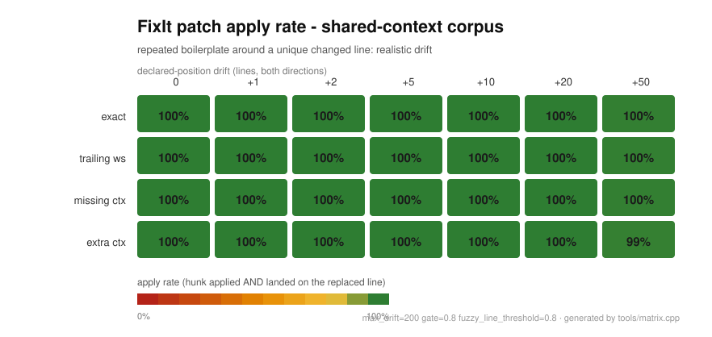
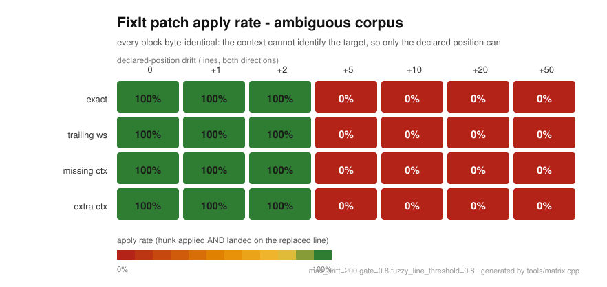

> **English** | [繁體中文](README.zh-TW.md)

# FixIt

[](https://github.com/wong060404/FixIt/actions/workflows/ci.yml)
[](#requirements)
[](LICENSE)

**A C++ library + CLI that closes the loop between compiler output and an LLM's
patches: compile → locate → LLM patch → fuzzy apply → re-verify.**

FixIt is not another wrapper around `patch(1)`. Its patch engine is built for the
patch a model *actually produces* — one with drifted line numbers, missing
context, and whitespace that does not quite match — and when a patch cannot be
applied it returns a structured explanation the model can act on, instead of an
exit code.

> **New here?** On Windows, start with
> [`WINDOWS-SETUP.md`](WINDOWS-SETUP.md) ([中文](WINDOWS-SETUP.zh-TW.md)): clone, build
> and repair your first file, with nothing installed system-wide.

### Documentation

Every prose document in this repository exists in English and Traditional Chinese
(`.zh-TW`).

| Document | English | 繁體中文 |
|---|---|---|
| Getting started on Windows: clone → build → run → repair a file | [WINDOWS-SETUP.md](WINDOWS-SETUP.md) | [WINDOWS-SETUP.zh-TW.md](WINDOWS-SETUP.zh-TW.md) |
| This README | [README.md](README.md) | [README.zh-TW.md](README.zh-TW.md) |
| Design decisions (ADRs) | [docs/decisions.md](docs/decisions.md) | [docs/decisions.zh-TW.md](docs/decisions.zh-TW.md) |
| Wiki outline | [docs/wiki_outline.md](docs/wiki_outline.md) | [docs/wiki_outline.zh-TW.md](docs/wiki_outline.zh-TW.md) |
| Compiler fixtures | [tests/fixtures/compiler/README.md](tests/fixtures/compiler/README.md) | [tests/fixtures/compiler/README.zh-TW.md](tests/fixtures/compiler/README.zh-TW.md) |
| Recorded demo transcript | [docs/demo_output.txt](docs/demo_output.txt) | — (byte-exact program output, asserted by the test suite) |

---

## 1. What & Why

Agentic C++ repair has one bottleneck that is not the model: **the patch does
not apply.** The model writes a perfectly reasonable edit, `@@ -14,4 +14,5 @@`
is off by two lines because the file changed, and `patch(1)` refuses the whole
diff. The model never learns *why*, so it guesses again and burns another round.

FixIt closes that circle:

| Step | What FixIt does |
|---|---|
| compile | runs the real compiler, parses diagnostics into data (not text) |
| locate | maps a diagnostic to its enclosing function and a numbered snippet |
| patch | scores every plausible position with a sliding window and applies the best one |
| re-verify | recompiles; only the compiler decides whether the repair worked |
| on failure | returns `score`, the closest match, the exact line that differed, and a suggested re-read |



## 2. Innovation

1. **Fuzzy patch engine.** Every candidate position is scored
   (`exact`/`fuzzy`/`mismatch`, normalised so a perfect hunk is `1.00`), searched
   through the window ladder `±0 → ±1 → ±2 → ±5 → ±10 → ±50 → global`, and gated
   at `score ≥ 0.80` with at least one exact line. Line-number drift, missing
   context and trailing-whitespace differences all apply anyway.
2. **Structured failure that feeds the loop.** A refused hunk yields
   `score 0.55 < gate 0.80 … expected line 14 to contain 'return x;' but the
   file has 'return 0;'. Closest match at line 15 … re-read lines 12-18` — text
   designed to be pasted straight back into the next prompt.
3. **The compiler is the only ground truth.** A model that answers `FINAL` still
   triggers a compile; `success` is set only by a clean exit. The mock rules,
   the trace format and the CLI all read from that one source.

## 3. Quick Start

```bash
git clone https://github.com/wong060404/FixIt.git
cd FixIt
cmake -B build -DCMAKE_BUILD_TYPE=Release && cmake --build build -j && ctest --test-dir build --output-on-failure
```

> **Windows:** nothing has to be installed system-wide. A portable MinGW-w64 GCC is
> fetched by `python tools\windows\fetch_mingw.py`, and
> `tools\windows\build_fixit.ps1` builds the same two binaries without CMake (the CMake
> generators cannot be used here — see the script header for why). Follow
> [`WINDOWS-SETUP.md`](WINDOWS-SETUP.md) (or
> [`WINDOWS-SETUP.zh-TW.md`](WINDOWS-SETUP.zh-TW.md) 中文版) for a step-by-step guide
> that starts from a bare Windows machine and ends with a repaired file, using either a
> local model or your own OpenAI-compatible endpoint. Two helper scripts cover the model
> backends: `tools\windows\llm-relay.py` reaches https endpoints from this TLS-less
> build, and `tools\windows\probe-endpoint.py` checks an endpoint, key and model before a
> run.

Then run the section-0 acceptance command:

```bash
./build/bin/fixit examples/buggy/e1_missing_include.cpp --agent --llm mock --verbose
```

Expected: the transcript in §4, and exit code `0`. Nothing in this path touches
the network.

That command repairs the example in place. Add `--no-write` to repair a scratch
copy instead and leave the working tree byte-identical — which is what the CI
smoke test uses (and what `tools/record_demo.sh` achieves by running on a temporary
copy), so both can be re-run at any time.

`--llm mock` is the built-in offline model: it repairs two specific fault shapes
and is what the test suite and demo use. To repair arbitrary code with your own
model, see [§6.6 Using a real model over https](#66-using-a-real-model-over-https);
to repair a file that includes project headers, see
[§6.5](#65-repairing-a-file-that-has-project-headers).

### Requirements

* **CMake ≥ 3.20, installed and on `PATH`.** The build cannot bootstrap its own
  build system: if `cmake` is missing, install it first (for example
  `brew install cmake`, or `pip install cmake` and put its `bin/` directory on
  `PATH` — a pip-installed CMake works, but only once it is findable as `cmake`).
* A C++20 compiler: gcc 12 / clang 15 or newer. On macOS `clang++` is fine; note
  that an Apple clang build has no JSON diagnostics, which FixIt detects and
  falls back from automatically (ADR-007).
* Python ≥ 3.8 only for the maintenance scripts that regenerate artefacts
  (`tools/gen_golden_cases.py`, `tools/render_heatmap.py`, `tools/gen_expected.sh`).
  The test suite itself never shells out to Python.

Dependencies come from the vendored snapshot in `third_party/`; a checkout that
lacks it (for example a tarball of just the sources) falls back to `FetchContent`
against the pinned upstream revisions, which needs network access at configure
time. Both paths are exercised and both build.

Two things learned while verifying that fallback:

* The pins are kept identical to the snapshot, including a commit SHA for
  tree-sitter — 0.28.0 is not tagged upstream yet (the newest tag is v0.27.0), so a
  tag would silently fetch different code. Bump the snapshot and the pin together.
* `FetchContent` builds cpp-httplib from source, and its CMake looks for optional
  compression libraries. If a package manager on your machine provides a
  different-architecture zstd/OpenSSL, configure finds it and the link fails with
  `ignoring file … found architecture 'x86_64', required architecture 'arm64'`.
  Point CMake away from it: `-DCMAKE_IGNORE_PATH=/opt/anaconda3` (or wherever that
  tree lives). The vendored snapshot build is unaffected.

### Building and debugging in VS Code

The checked-in `.vscode/` folder is set up for this CMake project, so `F5` builds
with CMake first and then debugs `build/bin/*` with lldb:

| Action | How |
| --- | --- |
| Build everything | `Cmd+Shift+B` (task `cmake: build`) |
| Debug the CLI on the file you have open | `F5` → `fixit CLI：對目前檔案跑 --outline（mock LLM）` |
| Debug a test binary | `F5` → `測試：compiler.test` (one entry per test binary) |
| Run the whole suite | task `test: 全部 ctest` |
| Re-generate the build dir | task `cmake: configure` |

`cmake` is not installed system-wide on this machine; the tasks and the CMake
Tools integration point at the bundled copy in
`../.buildtools/cmake/data/bin/cmake`.

**Do not debug with `C/C++: 建置使用中檔案`.** That auto-generated task compiles a
single `.cpp` in isolation, which cannot work here:

* `src/*.cpp` and `tests/*.cpp` need the CMake-provided include paths (Catch2,
  tree-sitter, `httplib`), so a lone `clang++ file.cpp` fails with
  `'catch2/catch_test_macros.hpp' file not found`.
* `examples/buggy/e1`–`e3` are **intentionally broken** fixtures — a failed compile
  is their designed behaviour, not an environment problem. `e4_testing.cpp` is a
  scratch file kept from manual testing; it compiles cleanly and no test or demo
  references it.

If `F5` ever reports *"Errors exist after running preLaunchTask"*, run
`cmake: build` once and read the compile output: it is a real compiler error, or
the wrong kind of file was being compiled in isolation.

## 4. Demo Transcript

Recorded from a real run; the full transcript, with all three examples and every
diagnostic, is [`docs/demo_output.txt`](docs/demo_output.txt).

```
$ fixit e1_missing_include.cpp --agent --llm mock --verbose --compiler clang++

══ FixIt v0.1.0 · agent mode (mock) ══

── iteration 1 ----------------------------
$ clang++ -fsyntax-only e1_missing_include.cpp
  ✗ 5 errors
    [E1]   L10   expected ';' at end of declaration
    [E2]   L14   no member named 'vector' in namespace 'std'
    [E3]   L14   expected '(' for function-style cast or type construction
    [E4]   L14   use of undeclared identifier 'words'
    [E5]   L14   expected expression
  → context: fn parse_count() [L9–L12]
  → patch…
    ✓ hunk 1 @ L8    (exact)
── iteration 2 ----------------------------
$ clang++ -fsyntax-only e1_missing_include.cpp
  ✗ 1 error
    [E1]   L11   expected ';' at end of declaration
  → context: fn parse_count() [L10–L13]
  → patch…
    ✓ hunk 1 @ L11   (fuzzy, drift-1)
$ clang++ -fsyntax-only e1_missing_include.cpp
  ✓ clean
✔ Fixed 5 errors in 2 iterations
```

The two hunks are the two planted bugs: a missing semicolon (line 10) and a
`<vector>` that was never included. The first lands exactly; the second is declared
one line off, which the argument does not matter for — the window search finds it.
`e2_drift.cpp` carries the same two bugs 37 lines further down, so *both* declared
positions are wrong and the search still repairs it. `e3_type_error.cpp` is
deliberately outside the mock's rule set: the loop reports it unfixed (exit `1`)
rather than pretending, and it is the fixture for a real model.

The transcript is regenerated by `tools/record_demo.sh` and is byte-reproducible
(`--no-timing`, `NO_COLOR=1`), so CI can diff it.

## 5. Architecture

```
              ┌──────────────────────── fixit-cli ────────────────────────┐
              │  parse args · verbose transcript · --trace · --metrics    │
              └───────────────┬───────────────────────────────────────────┘
                              │
                      ┌───────▼────────┐        structured events
                      │  fixit::Agent  │◄────── Compile / Patch observations
                      └───┬────────┬───┘
        tool calls        │        │        messages + tool schemas
      ┌───────────────────┘        └────────────────────┐
      │                                                 │
┌─────▼──────────┐  ┌──────────────┐  ┌──────────┐  ┌───▼─────────┐
│ ToolRegistry   │  │ CodeMap      │  │ Compiler │  │ Llm         │
│ compile        │  │ tree-sitter  │  │ g++ /    │  │ ├ MockLlm   │
│ read           │  │ · functions  │  │ clang++  │  │ └ OpenAiLlm │
│ patch ─────────┼─►│ · includes   │  │ JSON or  │  │  (httplib)  │
└────────────────┘  │ · snippets   │  │ text     │  └─────────────┘
                    └──────────────┘  └──────────┘
                            │
                    ┌───────▼────────┐
                    │  PatchEngine   │  scoring · sliding window · gate
                    │  (the core)    │  structured failure reports
                    └────────────────┘
```

Everything below `Agent` is a plain library: link `libfixit` and drive the loop
yourself, or reuse `PatchEngine` on its own to make *someone else's* diffs apply.

## 6. Modules

### 6.1 `fixit::Compiler` — [`include/fixit/compiler.h`](include/fixit/compiler.h)

```cpp
struct CompilerConfig {
  std::string compiler = "g++";
  int error_limit = 5;
  int timeout_seconds = 30;
  std::vector<std::string> extra_flags;
  DiagnosticFormat format = DiagnosticFormat::Auto;  // Auto | Text | Json
};

Compiler compiler(CompilerConfig{.compiler = "clang++"});
CompileResult result = compiler.compile("src/parse_config.cpp");
```

* Runs `<compiler> -std=c++20 -fsyntax-only [probed flags] [extra flags] <file>`
  through `fork`/`exec` with stdout and stderr merged into one pipe.
* **Every optional flag is probed, never assumed — including by compiler name.**
  `-fjson-diagnostics` and `-fdiagnostics-format=json` are tried in turn and the
  text parser is the fallback, so an unusual clang degrades instead of losing every
  diagnostic. `-ferror-limit=N` is only passed when the compiler accepts it: GCC
  has no equivalent and exits on the flag itself (ADR-024). `CompilerConfig::format`
  can force a parser, and forcing the text parser also stops the JSON flag from
  being sent — otherwise the compiler would emit JSON for a text parser to read as
  zero diagnostics. Pass project flags with `-I`/`-D`/`--flag` (see §6.5).
* Diagnostics are sorted by `(file, line, col, message)`, de-duplicated and
  capped at 50. `CompileResult::clean()` is the loop's ground truth.
* Timeout kills the child and keeps the output captured so far
  (`timed_out == true`).

### 6.2 `fixit::CodeMap` — [`include/fixit/codemap.h`](include/fixit/codemap.h)

```cpp
CodeMap map("src/parse_config.cpp");
map.functions();                       // {name, signature, start_line, end_line}
map.enclosing_function(14, 5);         // innermost function containing the caret
map.includes();                        // {"<cstdio>", "\"local.h\""}
map.context_snippet(14, 12);           //   13 |   ...
map.has_syntax_errors();
```

`signature` is the declaration text from the first line of the definition up to
(but excluding) the body's `{`. `context_snippet` is `%4d | text`, clamped to the
file, which is exactly the shape a model can quote back. A missing or unparsable
file never throws: the map degrades and `has_syntax_errors()` returns `true`.

### 6.3 `fixit::PatchEngine` — [`include/fixit/patch.h`](include/fixit/patch.h) ★

```cpp
PatchEngine engine;  // PatchConfig{max_drift=200, fuzzy_line_threshold=0.8, gate=0.8}
PatchResult result = engine.apply(file_content, unified_diff, "parse_config.cpp");
result.all_applied;        // every hunk passed the gate
result.new_content;        // applied hunks written, refused hunks untouched
result.reports;            // per-hunk status, score, positions, top candidates
result.failure_summary();  // ready to feed back to the model
```

Scoring for candidate position `p`:

```
exact(p)    = signature lines equal after trailing-whitespace normalisation
fuzzy(p)    = lines not exactly equal but Levenshtein ratio >= 0.8
mismatch(p) = everything else
score(p)    = (0.6*exact + 0.3*fuzzy - 0.2*mismatch) / (0.6 * signature.size())
```

The denominator normalises by the best attainable raw score so a perfect hunk is
`1.00` and the documented `gate = 0.8` is meaningful (see
[`docs/decisions.md`](docs/decisions.md) ADR-002 — the literal formula in the
original brief tops out at `0.60` and would fail its own gate). A hunk applies
only when `score >= gate` **and** `exact >= 1`; hitting inside `±0` is `Applied`,
anything else is `FuzzyApplied`.

Failure output looks like this and is the whole point:

```
Patch failed for parse_config.cpp:
- Hunk 1: APPLIED @ line 8 (exact, score 1.00)
- Hunk 2: FAILED (score 0.55 < gate 0.80. Declared position line 14 but the
  closest match is line 15 (score 0.70, exact 1/3). Window tried: +/-0..+/-200 plus global scan
  plus global scan. Context mismatch: expected line 15 to contain 'return x;'
  but the file has 'return 0;'.). Closest match at line 15
  Suggested fix: re-read lines 12-18 and retry with corrected context.
```

### 6.4 `fixit::Agent` — [`include/fixit/agent.h`](include/fixit/agent.h)

```cpp
Agent agent(make_standard_tools(workdir), std::make_unique<MockLlm>(),
            Compiler(CompilerConfig{.compiler = "g++"}), workdir);
agent.set_trace_path("trace.json");
agent.set_observer([](const Agent::Event& event) { /* live progress */ });
AgentResult result = agent.run("parse_config.cpp", /*max_iterations=*/4);
```

The three standard tools live in `make_standard_tools`, and any additional tool is
just another `ToolRegistry::add`:

| Tool | Arguments | Returns |
|---|---|---|
| `compile` | `{file}` | diagnostics as data, plus the compiler's own `raw_output` when it said anything |
| `read` | `{file, start, end, outline?}` | the numbered line range (inclusive, 1-based) and a CodeMap `outline` (functions, includes, syntax-error lines) — `outline` defaults to on |
| `patch` | `{file, diff}` | one report per hunk (`status`, `declared_pos`, `matched_pos`, `score`), or the parse-failure reason and the received diff when nothing could be read |

`read` and `patch` resolve every path inside the agent's workdir: absolute paths
and `..` are refused, because the read result is forwarded to a remote model and
`patch` writes through the same resolver.

`MockLlm` is rule-based and offline; when it emits a patch it deliberately declares
the wrong line (`+1`), so every demo also exercises the fuzzy path. `OpenAiLlm`
speaks `/v1/chat/completions` over `cpp-httplib` and sends a well-formed
conversation: the assistant turn carrying `tool_calls` is included, and each tool
result references its `tool_call_id`, so a strict server does not reject the second
round.

### 6.5 Repairing a file that has project headers

`fixit` starts its own compiler, so a file that includes a project header needs to
be told where that header lives:

```bash
./build/bin/fixit src/parser.cpp -Iinclude -Ithird_party/lib -DDEBUG=1 --agent --llm mock
```

`-I DIR` / `--include DIR`, `-D NAME[=VALUE]` and `--flag FLAG` are passed to the
compiler verbatim and are repeatable; the joined `-Iinclude` form works too.  The
echoed command line shows exactly what was run:

```
$ g++ -std=c++20 -fsyntax-only -Iinclude src/parser.cpp
```

Without the flags the compiler stops at `'x.h' file not found` and never reaches
the real errors.  Easiest habit: run `fixit` from the directory you would normally
compile from, with the same `-I` flags you already use, or let
`compile_commands.json` tell you what they are.

### 6.6 Using a real model over https

The default build has no TLS, because OpenSSL is not one of the four permitted
dependencies.  `https://` endpoints therefore need a TLS-enabled build:

```bash
cmake -B build-tls -DCMAKE_BUILD_TYPE=Release -DFIXIT_ENABLE_OPENSSL=ON
cmake --build build-tls -j
```

`find_package(OpenSSL)` locates a system OpenSSL.  Two macOS specifics are worth
knowing, both learned the hard way on this project:

* cpp-httplib loads the trust store from the **Keychain** on Apple, which needs
  `CoreFoundation` and `Security`; the build links them automatically.  Pass
  `-DFIXIT_MACOS_KEYCHAIN_CERTS=OFF` to skip that and use a CA bundle instead.
* A system OpenSSL does **not** read the Keychain, so `https://` fails with
  `SSL server verification failed` even against a valid Let's Encrypt
  certificate.  `OpenAiLlm` therefore points OpenSSL at a bundle explicitly:
  `$FIXIT_CA_BUNDLE` if set, otherwise `/etc/ssl/cert.pem` on macOS (the bundle
  macOS ships for its own curl), otherwise the usual Linux paths.  Verification
  is never disabled.

Then run against any OpenAI-compatible endpoint:

```bash
export FIXIT_API_KEY=sk-...          # or: --api-key

./build-tls/bin/fixit your_file.cpp --agent --llm openai \
  --base-url https://your-endpoint/v1 \
  --model your-model --verbose --no-write
```

`tools/fixit_with_my_key.sh` wraps this for a project-local setup: it reads the
key from `$FIXIT_API_KEY` or a git-ignored `.secrets/fixit_key`, keeps it out of
`argv` (so it cannot appear in `ps` output or a log), and unexports it before the
child runs, so no trace or metrics file can contain it.

### 6.7 CLI

```
fixit <file.cpp> [--agent] [--llm mock|openai] [--model NAME]
      [--base-url URL] [--api-key KEY | env FIXIT_API_KEY]
      [--iterations N] [--verbose] [--trace PATH] [--metrics PATH]
      [--compiler NAME] [--no-write] [--no-timing] [--outline]
      [-I DIR | --include DIR]... [-D NAME[=VALUE]]... [--flag FLAG]...
```

Defaults: `--llm mock`, `--model gpt-4o-mini`, `--base-url
https://api.openai.com/v1`, `--iterations 4`, `--compiler g++`. `--define` is
accepted as a synonym for `-D`, and `-h`/`--help` prints the same text as this
section.

Without `--agent` it compiles once and prints the diagnostics. Exit codes:

| Code | Meaning |
|---|---|
| `0` | clean, or repaired and re-verified clean |
| `1` | not repaired (the remaining errors are listed) |
| `2` | usage error, unreadable file, or `--llm openai` without a key |
| `3` | internal error (an unexpected exception; a backstop, not a normal path) |

`--no-timing` omits wall-clock reports so output can be diffed between runs — that
is how [`docs/demo_output.txt`](docs/demo_output.txt) stays byte-reproducible.
ANSI colour is suppressed when stdout is not a TTY or `NO_COLOR` is set, which
keeps that file diffable.

### 6.8 Regression worth knowing about

A hunk that **inserts** lines while quoting surrounding context used to consume one
file line too many, silently deleting the line after the insertion point.  It was
found by driving the engine with a real model rather than by the golden corpus —
every generated case replaced lines, so none combined quoted context with an added
line.

The apply path now derives the replaced span from the hunk's old side (context plus
removals) and only widens it towards a *larger* count declared in the header, which
is the case the header exists to rescue.  `[patch][regression]` in
`tests/patch_golden.test.cpp` covers it, and ADR-028 records the defect, the two
reverted attempts and the final fix.

## 7. Testing

```bash
ctest --test-dir build --output-on-failure
```

| Suite | Contents |
|---|---|
| `patch_golden.test` | **60 golden patches** (10 exact, 10 line-drift, 10 whitespace, 10 missing-context, 10 extra-context, 10 multi-hunk) asserting `all_applied` and byte-exact output, plus **10 negative cases** asserting refusal, untouched content, and a `failure_reason` that contains the score, the gate, the window and the offending line; plus insertion/deletion round-trips and the regression for the insertion hunk that used to consume the following line |
| `compiler.test` | 20 fixtures (recorded clang output + GCC-format output); a gcc/clang **parity** check on purpose-built sources asserting line-for-line agreement; and a structural check over `e1`–`e3` (both call the file broken, first anchors within two lines, both name the planted fault) because per-line agreement is not attainable across compilers on deliberately broken input (ADR-023/025) |
| `codemap.test` | five sample files: function lists, innermost `enclosing_function`, verbatim includes, snippet format and clamping, syntax errors, missing files |
| `agent_mock.test` | full loop on `e1`/`e2` (success, clean compile, patch reports), `e3` unfixed without crashing, trace schema, byte-identical repeat runs, tool dispatch and sandboxing, and an unusable compiler failing in one round |
| `expected_artifacts.test` | `examples/buggy/expected/` matched against a live mock run, plus the committed demo transcript being timing-free |
| `cli_contract.test` | the binary's observable behaviour: exit codes, usage errors, a directory rejected instead of "compiling clean", `--outline`, `--no-write` leaving the file byte-identical, `--no-timing`, and `-I`/`-D`/`--flag` reaching the compiler |

The golden cases are generated by [`tools/gen_golden_cases.py`](tools/gen_golden_cases.py)
into `tests/patch_golden_cases.inc`, which is committed — the C++ suite never
needs Python.

Every test is offline and deterministic: `MockLlm` has no I/O, and the
integration test asserts that two runs of the same input produce byte-identical
traces.

## 8. Reusability Justification

> tree-sitter-cpp 只能解析、cpp-httplib 只能送 HTTP、diffutils 只能機械式套用 diff。
> **沒有現成 C++ 庫能閉環「compiler diagnostics → code location → LLM patch →
> fuzzy apply → re-verify」並把失敗原因結構化回傳給 LLM**。FixIt 補上這層，任何
> agentic coding 工具（CI 修復 bot、IDE 插件）可直接 link。

Concretely, `libfixit` is an ordinary CMake target with a header-only-style surface
(`include/fixit/*.h`), no globals and no CLI dependency: `add_subdirectory` and link
it. A CI repair bot can use just `Compiler` + `PatchEngine`, an IDE plugin can use
`CodeMap` alone, and an agent product can take the whole `Agent`. Installing the
library, exporting it and shipping a package config are deliberately *not* done
yet -- that work is listed in the roadmap.

## 8a. Measured effectiveness

`./build/bin/fixit-matrix` sweeps well-formed diffs whose imperfection is
controlled, and `python3 tools/render_heatmap.py` turns the result into the heat
maps under `docs/`. Current numbers (200 trials per cell):

| Corpus | Drift tolerance |
|---|---|
| Unique lines, 3 context lines | **100%** up to ±20 lines of drift, 99% at ±50 |
| Realistic boilerplate (`}`, blank lines, near-identical bodies) | **100%** up to ±20, 99% at ±50 |
| Every block byte-identical | 100% up to ±2, **0% at ±5 and beyond** |

All four impairments are present in every row — exact, trailing whitespace,
missing context and extra context — so a cell is the rate for that impairment at
that drift.

The same numbers as heat maps: rows are the four impairments, columns are the
declared-position drift, and 200 trials were run per cell.

**Unique lines, 3 context lines** — the claim the project makes



**Repeated boilerplate around a unique changed line** — realistic drift



**Every block byte-identical** — the honest limit



The first two rows are the claim the project makes. The third row is its honest
limit: when the context matches several places equally well *and* the declared
position is wrong, no algorithm can recover the intent — FixIt applies to the
nearest candidate, which the sweep counts as a miss. See
[`docs/wiki_outline.md`](docs/wiki_outline.md) and
[`docs/patch_success_matrix.json`](docs/patch_success_matrix.json).

## 9. Roadmap

* **A published evaluation against a hosted model.** The harness works end to end
  against a real OpenAI-compatible endpoint (see §6.6), but the numbers in §8a come
  from the synthetic sweep, not from a model. Running the fixture set through a
  hosted model — including `e3`, which the mock deliberately refuses — is the
  missing evidence, not the missing plumbing.
* **Multi-file projects** — `PatchEngine::parse_diff` already returns several
  `DiffFile`s and `Agent` can patch any of them; the missing piece is a build
  system adapter that produces per-file diagnostics for a whole target. Reading
  `compile_commands.json` would also remove the need to pass `-I` by hand.
* **Packaging** — `install()`/export rules and a package config, then vcpkg/Conan
  recipes, so consumers do not build tree-sitter themselves.
* **Demo video** — the transcript is recorded and reproducible
  (`tools/record_demo.sh`); the screen recording is not made yet.

## Layout

```
fixit/
├── include/fixit/{compiler,codemap,patch,agent,types}.h
├── src/{compiler,codemap,patch,agent,openai_llm,mock_llm}.cpp
├── tools/fixit-cli/main.cpp
├── tools/matrix.cpp                     # the sweep behind §8a
├── tools/{gen_golden_cases.py,render_heatmap.py,gcc_sim.py,summarise_trace.py}
├── tools/{record_demo.sh,gen_expected.sh,record_compiler_fixtures.sh}
├── tools/{fixit_with_my_key.sh,push_to_github.sh}
├── tests/{patch_golden,compiler,codemap,agent_mock,expected_artifacts,cli_contract}.test.cpp
├── tests/fixtures/{compiler,codemap}/
├── examples/buggy/{e1_missing_include,e2_drift,e3_type_error}.cpp
├── examples/buggy/e4_testing.cpp       # scratch file from manual testing; not a fixture
├── examples/buggy/expected/             # repaired content + trajectories
├── docs/{decisions.md,demo_output.txt,patch_success_matrix.json,wiki_outline.md}
├── docs/patch_success_heatmap*.svg      # three heat maps rendered from the matrix
├── .github/workflows/ci.yml
├── .secrets/                            # git-ignored; API key for a real endpoint
└── third_party/                         # pinned snapshot; FetchContent fallback
```

## Design decisions

Every ambiguity in the original brief is resolved and recorded in
[`docs/decisions.md`](docs/decisions.md) (ADR format: context / decision /
rationale) — the scoring normalisation, the window ladder, partial-apply
semantics, the mock's deliberate drift, dependency pinning, the API-key policy,
and the platform notes.
