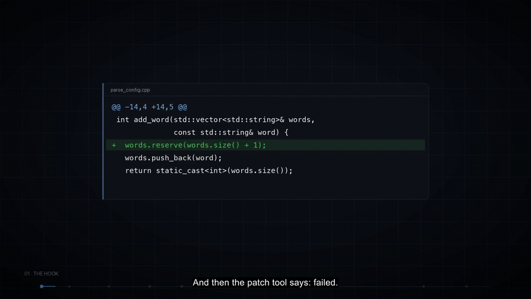

> [English](README.md) | **繁體中文**

# FixIt

[](https://github.com/wong060404/FixIt/actions/workflows/ci.yml)
[](#requirements)
[](LICENSE)

**一套 C++ 函式庫 + CLI，把編譯器輸出與 LLM 的
patches 串成一個閉環：compile → locate → LLM patch → fuzzy apply → re-verify。**

FixIt 並不是另一個包裝 `patch(1)` 的工具。它的修補引擎是為模型*實際產出*的
patch 而打造 —— 那種行號已經漂移、缺少上下文、空白又對不齊的 patch —— 而當
patch 套用不上時，它回傳的是模型可以據以行動的結構化說明，而不是一個
結束碼。

### 看它怎麼運作

[](docs/fixit_intro_subs.mp4)

**▶ [觀看完整 4 分鐘介紹影片](docs/fixit_intro_subs.mp4)** · [英文字幕](docs/fixit_intro.srt)

上方是整支影片的 32 秒無聲導覽，取自有旁白的完整版本。影片開頭就是這個專案存在的
理由：模型的 diff 是對的，`patch(1)` 卻只回傳一個結束碼。以下所有內容，都是為了把
這個閉環補起來。

> **第一次來嗎？** 在 Windows 上，請從
> [`WINDOWS-SETUP.md`](WINDOWS-SETUP.md)（[中文](WINDOWS-SETUP.zh-TW.md)）開始：clone、建置
> 並修好你的第一個檔案，完全不需要在全系統安裝任何東西。

### 文件

本儲存庫中的每一份散文文件都有英文與繁體中文
（`.zh-TW`）兩種版本。

| 文件 | English | 繁體中文 |
|---|---|---|
| Windows 入門：clone → build → run → 修好一個檔案 | [WINDOWS-SETUP.md](WINDOWS-SETUP.md) | [WINDOWS-SETUP.zh-TW.md](WINDOWS-SETUP.zh-TW.md) |
| 本 README | [README.md](README.md) | [README.zh-TW.md](README.zh-TW.md) |
| 設計決策（ADR） | [docs/decisions.md](docs/decisions.md) | [docs/decisions.zh-TW.md](docs/decisions.zh-TW.md) |
| Wiki 大綱 | [docs/wiki_outline.md](docs/wiki_outline.md) | [docs/wiki_outline.zh-TW.md](docs/wiki_outline.zh-TW.md) |
| 編譯器 fixture | [tests/fixtures/compiler/README.md](tests/fixtures/compiler/README.md) | [tests/fixtures/compiler/README.zh-TW.md](tests/fixtures/compiler/README.zh-TW.md) |
| 錄製的 demo 逐字稿 | [docs/demo_output.txt](docs/demo_output.txt) | —（程式輸出的位元完全一致版本，由測試套件斷言） |
| 介紹影片（4 分鐘，含字幕） | [docs/fixit_intro_subs.mp4](docs/fixit_intro_subs.mp4) | —（英文字幕：[docs/fixit_intro.srt](docs/fixit_intro.srt)） |

---

## 1. 是什麼與為什麼

Agentic C++ 修復有一個瓶頸，而且問題不在模型：**patch 套用不上。**
模型寫出一段完全合理的修改，`@@ -14,4 +14,5 @@` 卻因為檔案已變動而差了兩行，
`patch(1)` 便拒絕整份 diff。模型永遠不會知道*為什麼*，於是只能再猜一次，又浪費
一輪。

FixIt 把這個循環閉合起來：

| 步驟 | FixIt 做什麼 |
|---|---|
| compile | 執行真正的編譯器，把診斷訊息解析成資料（而非文字） |
| locate | 把一則診斷對應到它所在的函式，以及一段附行號的程式碼片段 |
| patch | 用滑動視窗為每個可能位置評分，並套用最佳的那一個 |
| re-verify | 重新編譯；只有編譯器能判定修復是否成功 |
| on failure | 回傳 `score`、最接近的相符位置、真正不同的那一行，以及建議重新讀取的範圍 |


## 2. 創新之處

1. **模糊修補引擎（fuzzy patch engine）。** 每個候選位置都會被評分
   （`exact`/`fuzzy`/`mismatch`，並經正規化，使完美的 hunk 為 `1.00`），依
   視窗階梯 `±0 → ±1 → ±2 → ±5 → ±10 → ±50 → global` 逐層搜尋，並以
   `score ≥ 0.80` 且至少有一行完全相符作為門檻。行號漂移、缺少上下文與行尾
   空白差異，都仍能套用。
2. **能回饋到迴圈的結構化失敗。** 被拒絕的 hunk 會產生
   `score 0.55 < gate 0.80 … expected line 14 to contain 'return x;' but the
   file has 'return 0;'. Closest match at line 15 … re-read lines 12-18` —— 這種
   文字就是設計來直接貼回下一次的提示詞。
3. **編譯器是唯一的事實依據。** 就算模型回答 `FINAL`，仍會觸發一次編譯；
   `success` 只有在乾淨結束時才會被設定。mock 規則、trace 格式與 CLI 全都讀取
   這同一個來源。

## 3. 快速開始

```bash
git clone https://github.com/wong060404/FixIt.git
cd FixIt
cmake -B build -DCMAKE_BUILD_TYPE=Release && cmake --build build -j && ctest --test-dir build --output-on-failure
```

> **Windows：** 不需要在全系統安裝任何東西。可攜式的 MinGW-w64 GCC 會由
> `python tools\windows\fetch_mingw.py` 取得，而
> `tools\windows\build_fixit.ps1` 不用 CMake 也能建出同樣的兩個執行檔（此處無法
> 使用 CMake 產生器 —— 原因見該腳本的檔頭說明）。請照著
> [`WINDOWS-SETUP.md`](WINDOWS-SETUP.md)（或
> [`WINDOWS-SETUP.zh-TW.md`](WINDOWS-SETUP.zh-TW.md) 中文版）的逐步指南操作，
> 它從一台乾淨的 Windows 機器開始，最後得到一個已修好的檔案，你可以使用本機
> 模型，也可以使用自己的 OpenAI 相容端點。有兩支輔助腳本負責模型後端：
> `tools\windows\llm-relay.py` 讓這個沒有 TLS 的組建能連上 https 端點，
> `tools\windows\probe-endpoint.py` 則在執行前檢查端點、金鑰與模型。
> 執行。

接著執行第 0 節的驗收指令：

```bash
./build/bin/fixit examples/buggy/e1_missing_include.cpp --agent --llm mock --verbose
```

預期結果：§4 的逐字稿，以及結束碼 `0`。
完全不碰網路。

該指令會就地修復範例。加上 `--no-write` 則改為修復一份暫存副本，讓工作樹維持
位元組完全相同 —— CI 的冒煙測試用的就是這個方式（`tools/record_demo.sh` 也是靠
在臨時副本上執行來達成），因此兩者隨時都能重跑。
在臨時副本上執行來達成），所以兩者隨時都能重跑。

`--llm mock` 是內建的離線模型：它能修復兩種特定的錯誤樣態，測試套件與 demo 用的
就是它。若要用你自己的模型修復任意程式碼，請見
[§6.6 透過 https 使用真實模型](#66-using-a-real-model-over-https)；
若要修復一個會 include 專案標頭檔的檔案，請見
[§6.5](#65-repairing-a-file-that-has-project-headers)。

### 需求

* **CMake ≥ 3.20，已安裝且位於 `PATH` 上。** 組建過程無法自行 bootstrap 它的
  建置系統：若缺少 `cmake`，請先安裝（例如
  `brew install cmake`，或 `pip install cmake` 並把它的 `bin/` 目錄加入
  `PATH` —— 用 pip 安裝的 CMake 可以用，但前提是它必須能被找到為 `cmake`）。
* 支援 C++20 的編譯器：gcc 12 / clang 15 或更新版本。在 macOS 上 `clang++` 即可；
  請注意 Apple clang 的組建沒有 JSON 診斷訊息，FixIt 會偵測到並自動退回
  （ADR-007）。
* Python ≥ 3.8，僅用於重新產生衍生產物的維護腳本
  （`tools/gen_golden_cases.py`、`tools/render_heatmap.py`、`tools/gen_expected.sh`）。
  測試套件本身從不呼叫 Python。

相依項目來自 `third_party/` 中的內附快照；若某份 checkout 缺少它（例如只含
原始碼的 tarball），則會退回使用 `FetchContent` 對照鎖定的上游修訂版本，這在
configure 階段需要網路連線。兩條路徑都經過實際驗證，也都能建置成功。
configure 階段需要網路連線。兩條路徑都經過實測，兩者都能建置。

在驗證該退回路徑時學到的兩件事：

* 鎖定版本與快照保持完全一致，包含 tree-sitter 的 commit SHA —— 上游尚未為
  0.28.0 打上標籤（最新的標籤是 v0.27.0），所以用標籤會默默取得不同的程式碼。
  快照與鎖定版本要一起更新。
* `FetchContent` 會從原始碼建置 cpp-httplib，而它的 CMake 會尋找選用的壓縮
  函式庫。若你機器上的套件管理器提供了不同架構的 zstd/OpenSSL，configure 會
  找到它，連結便會失敗並出現
  `ignoring file … found architecture 'x86_64', required architecture 'arm64'`。
  請讓 CMake 避開它：`-DCMAKE_IGNORE_PATH=/opt/anaconda3`（或那棵樹實際所在的
  位置）。使用內附快照的組建不受影響。

### 在 VS Code 中建置與除錯

已納入版控的 `.vscode/` 資料夾是為這個 CMake 專案設定好的，因此 `F5` 會先用
CMake 建置，再以 lldb 除錯 `build/bin/*`：

| 動作 | 怎麼做 |
| --- | --- |
| Build everything | `Cmd+Shift+B`（任務 `cmake: build`） |
| Debug the CLI on the file you have open | `F5` → `fixit CLI：對目前檔案跑 --outline（mock LLM）` |
| Debug a test binary | `F5` → `測試：compiler.test`（每個測試執行檔一項） |
| Run the whole suite | 任務 `test: 全部 ctest` |
| Re-generate the build dir | 任務 `cmake: configure` |

這台機器並未在全系統安裝 `cmake`；相關任務與 CMake Tools 整合都指向
`../.buildtools/cmake/data/bin/cmake` 這份內附的副本。

**不要用 `C/C++: 建置使用中檔案` 來除錯。** 那個自動產生的任務會孤立地編譯單一
`.cpp`，在這裡行不通：

* `src/*.cpp` 與 `tests/*.cpp` 需要由 CMake 提供的 include 路徑（Catch2、
  tree-sitter、`httplib`），所以單獨執行 `clang++ file.cpp` 會失敗並出現
  `'catch2/catch_test_macros.hpp' file not found`。
* `examples/buggy/e1`–`e3` 是**刻意損壞**的 fixture —— 編譯失敗正是它們預期的
  行為，而不是環境問題。`e4_testing.cpp` 是手動測試時留下的暫存檔；它能乾淨
  編譯，也沒有任何測試或 demo 引用它。
  沒有任何測試或 demo 引用它。

若 `F5` 出現 *"Errors exist after running preLaunchTask"*，請先跑一次
`cmake: build` 並讀取編譯輸出：那是真正的編譯器錯誤，或是被孤立編譯的檔案類型
不對。

## 4. Demo 逐字稿

錄自一次真實執行；完整逐字稿包含全部三個範例與每一則診斷，位於
[`docs/demo_output.txt`](docs/demo_output.txt)。

```
$ fixit e1_missing_include.cpp --agent --llm mock --verbose --compiler clang++

══ FixIt v0.1.0 · agent mode (mock) ══

── iteration 1 ----------------------------
$ clang++ -fsyntax-only e1_missing_include.cpp
  ✗ 5 errors
    [E1]   L10   expected ';' at end of declaration
    [E2]   L14   no member named 'vector' in namespace 'std'
    [E3]   L14   expected '(' for function-style cast or type construction
    [E4]   L14   use of undeclared identifier 'words'
    [E5]   L14   expected expression
  → context: fn parse_count() [L9–L12]
  → patch…
    ✓ hunk 1 @ L8    (exact)
── iteration 2 ----------------------------
$ clang++ -fsyntax-only e1_missing_include.cpp
  ✗ 1 error
    [E1]   L11   expected ';' at end of declaration
  → context: fn parse_count() [L10–L13]
  → patch…
    ✓ hunk 1 @ L11   (fuzzy, drift-1)
$ clang++ -fsyntax-only e1_missing_include.cpp
  ✓ clean
✔ Fixed 5 errors in 2 iterations
```

這兩個 hunk 就是刻意植入的兩個 bug：一個缺少分號（第 10 行），以及一個從未
被 include 的 `<vector>`。第一個精準命中；第二個宣告的位置差了一行，但這對結果
沒有影響 —— 視窗搜尋會找到它。
`e2_drift.cpp` 把同樣的兩個 bug 搬到再往下 37 行的位置，因此*兩個*宣告位置都是
錯的，搜尋依然能修好它。`e3_type_error.cpp` 則刻意落在 mock 規則集之外：迴圈會
回報它未被修復（結束碼 `1`）而不是假裝成功，而它是給真實模型用的 fixture。
而不是假裝成功；它是保留給真實模型用的 fixture。

該逐字稿由 `tools/record_demo.sh` 重新產生，並且可位元重現
（`--no-timing`、`NO_COLOR=1`），所以 CI 可以對它做 diff。

## 5. 架構

```
              ┌──────────────────────── fixit-cli ────────────────────────┐
              │  parse args · verbose transcript · --trace · --metrics    │
              └───────────────┬───────────────────────────────────────────┘
                              │
                      ┌───────▼────────┐        structured events
                      │  fixit::Agent  │◄────── Compile / Patch observations
                      └───┬────────┬───┘
        tool calls        │        │        messages + tool schemas
      ┌───────────────────┘        └────────────────────┐
      │                                                 │
┌─────▼──────────┐  ┌──────────────┐  ┌──────────┐  ┌───▼─────────┐
│ ToolRegistry   │  │ CodeMap      │  │ Compiler │  │ Llm         │
│ compile        │  │ tree-sitter  │  │ g++ /    │  │ ├ MockLlm   │
│ read           │  │ · functions  │  │ clang++  │  │ └ OpenAiLlm │
│ patch ─────────┼─►│ · includes   │  │ JSON or  │  │  (httplib)  │
└────────────────┘  │ · snippets   │  │ text     │  └─────────────┘
                    └──────────────┘  └──────────┘
                            │
                    ┌───────▼────────┐
                    │  PatchEngine   │  scoring · sliding window · gate
                    │  (the core)    │  structured failure reports
                    └────────────────┘
```

`Agent` 以下的一切都是單純的函式庫：連結 `libfixit` 自行驅動迴圈，或單獨重用
`PatchEngine`，讓*別人的* diff 也能套用得上。

## 6. 模組

### 6.1 `fixit::Compiler` — [`include/fixit/compiler.h`](include/fixit/compiler.h)

```cpp
struct CompilerConfig {
  std::string compiler = "g++";
  int error_limit = 5;
  int timeout_seconds = 30;
  std::vector<std::string> extra_flags;
  DiagnosticFormat format = DiagnosticFormat::Auto;  // Auto | Text | Json
};

Compiler compiler(CompilerConfig{.compiler = "clang++"});
CompileResult result = compiler.compile("src/parse_config.cpp");
```

* 透過 `fork`/`exec` 執行
  `<compiler> -std=c++20 -fsyntax-only [probed flags] [extra flags] <file>`，
  並把 stdout 與 stderr 合併到同一個 pipe。
* **每個選用旗標都會先探測，絕不假設 —— 包括依照編譯器名稱所做的假設。**
  `-fjson-diagnostics` 與 `-fdiagnostics-format=json` 會依序嘗試，文字解析器則是
  退回方案，因此遇上不尋常的 clang 只會降級，而不會失去所有診斷訊息。
  `-ferror-limit=N` 只在編譯器接受時才會傳入：GCC 沒有對應選項，會直接因為這個
  旗標而結束（ADR-024）。`CompilerConfig::format` 可以強制指定解析器，而強制使用
  文字解析器時也會停止送出 JSON 旗標 —— 否則編譯器會輸出 JSON，而文字解析器把
  它讀成零則診斷。專案旗標請用 `-I`/`-D`/`--flag` 傳入（見 §6.5）。
* 診斷訊息會依 `(file, line, col, message)` 排序、去除重複，並上限為 50 則。
  `CompileResult::clean()` 是這個迴圈的事實依據。
* 逾時會終止子行程，並保留目前為止已捕捉到的輸出
  （`timed_out == true`）。

### 6.2 `fixit::CodeMap` — [`include/fixit/codemap.h`](include/fixit/codemap.h)

```cpp
CodeMap map("src/parse_config.cpp");
map.functions();                       // {name, signature, start_line, end_line}
map.enclosing_function(14, 5);         // innermost function containing the caret
map.includes();                        // {"<cstdio>", "\"local.h\""}
map.context_snippet(14, 12);           //   13 |   ...
map.has_syntax_errors();
```

`signature` 是從定義第一行起、直到函式主體 `{` 之前（不含 `{`）的宣告文字。
`context_snippet` 是 `%4d | text`，並裁剪至檔案範圍內，這正是模型可以直接
引述回去的形式。檔案不存在或無法解析時絕不拋出例外：對應表會降級，而
`has_syntax_errors()` 會回傳 `true`。

### 6.3 `fixit::PatchEngine` — [`include/fixit/patch.h`](include/fixit/patch.h) ★

```cpp
PatchEngine engine;  // PatchConfig{max_drift=200, fuzzy_line_threshold=0.8, gate=0.8}
PatchResult result = engine.apply(file_content, unified_diff, "parse_config.cpp");
result.all_applied;        // every hunk passed the gate
result.new_content;        // applied hunks written, refused hunks untouched
result.reports;            // per-hunk status, score, positions, top candidates
result.failure_summary();  // ready to feed back to the model
```

候選位置 `p` 的評分方式：

```
exact(p)    = signature lines equal after trailing-whitespace normalisation
fuzzy(p)    = lines not exactly equal but Levenshtein ratio >= 0.8
mismatch(p) = everything else
score(p)    = (0.6*exact + 0.3*fuzzy - 0.2*mismatch) / (0.6 * signature.size())
```

分母以可達到的最高原始分數做正規化，使完美的 hunk 為
`1.00`，而文件所述的 `gate = 0.8` 才有意義（見
[`docs/decisions.md`](docs/decisions.md) ADR-002 —— 原始需求書中的字面公式上限只到
`0.60`，會過不了它自己的門檻）。只有當 `score >= gate` **且** `exact >= 1` 時
hunk 才會套用；落在 `±0` 之內為 `Applied`，
其餘皆為 `FuzzyApplied`。

失敗輸出看起來像這樣，而這正是重點所在：

```
Patch failed for parse_config.cpp:
- Hunk 1: APPLIED @ line 8 (exact, score 1.00)
- Hunk 2: FAILED (score 0.55 < gate 0.80. Declared position line 14 but the
  closest match is line 15 (score 0.70, exact 1/3). Window tried: +/-0..+/-200 plus global scan
  plus global scan. Context mismatch: expected line 15 to contain 'return x;'
  but the file has 'return 0;'.). Closest match at line 15
  Suggested fix: re-read lines 12-18 and retry with corrected context.
```

### 6.4 `fixit::Agent` — [`include/fixit/agent.h`](include/fixit/agent.h)

```cpp
Agent agent(make_standard_tools(workdir), std::make_unique<MockLlm>(),
            Compiler(CompilerConfig{.compiler = "g++"}), workdir);
agent.set_trace_path("trace.json");
agent.set_observer([](const Agent::Event& event) { /* live progress */ });
AgentResult result = agent.run("parse_config.cpp", /*max_iterations=*/4);
```

三個標準工具都位於 `make_standard_tools` 中，而任何額外的工具都只是再一次
`ToolRegistry::add`：

| 工具 | 參數 | 回傳 |
|---|---|---|
| `compile` | `{file}` | 以資料形式呈現的診斷訊息，外加編譯器本身有輸出時的 `raw_output` |
| `read` | `{file, start, end, outline?}` | 附行號的行範圍（含頭尾、以 1 為基準）以及一份 CodeMap `outline`（函式、include、語法錯誤行）—— `outline` 預設為開啟 |
| `patch` | `{file, diff}` | 每個 hunk 一份報告（`status`、`declared_pos`、`matched_pos`、`score`），或在完全無法讀取時回傳解析失敗原因與所收到的 diff |

`read` 與 `patch` 會把每個路徑解析到 agent 的 workdir 之內：絕對路徑
與 `..` 都會被拒絕，因為讀取結果會被轉送給遠端模型，而
`patch` 也透過同一個解析器寫入。

`MockLlm` 是規則式且離線的；當它產生 patch 時，會刻意宣告錯誤的行號（`+1`），
因此每個 demo 也同時演練了模糊路徑。`OpenAiLlm`
透過 `cpp-httplib` 使用 `/v1/chat/completions`，並送出格式良好的
對話：夾帶 `tool_calls` 的 assistant 回合會被納入，而每個工具
結果都會引用它的 `tool_call_id`，因此嚴格的伺服器不會拒絕第二
輪。

### 6.5 修復帶有專案標頭檔的檔案

`fixit` 會啟動自己的編譯器，所以一個 include 了專案標頭檔的檔案必須被告知該
標頭檔的位置：

```bash
./build/bin/fixit src/parser.cpp -Iinclude -Ithird_party/lib -DDEBUG=1 --agent --llm mock
```

`-I DIR` / `--include DIR`、`-D NAME[=VALUE]` 與 `--flag FLAG` 都會原樣傳給
編譯器，且可重複使用；合併後的 `-Iinclude` 形式也可以用。回顯的指令列會顯示
實際執行的內容：

```
$ g++ -std=c++20 -fsyntax-only -Iinclude src/parser.cpp
```

沒有這些旗標時，編譯器會停在 `'x.h' file not found`，永遠到不了真正的錯誤。
最省事的習慣：從你平常編譯時所用的目錄執行 `fixit`，並帶上你原本就在用的同一組
`-I` 旗標，或者讓
`compile_commands.json` 告訴你它們是什麼。

### 6.6 透過 https 使用真實模型

預設組建沒有 TLS，因為 OpenSSL 不在四個獲准的相依項目之列。因此 `https://`
端點需要一個啟用 TLS 的組建：

```bash
cmake -B build-tls -DCMAKE_BUILD_TYPE=Release -DFIXIT_ENABLE_OPENSSL=ON
cmake --build build-tls -j
```

`find_package(OpenSSL)` 會找到系統上的 OpenSSL。有兩個 macOS 的細節值得
知道，兩者都是在這個專案上辛苦摸索出來的：

* cpp-httplib 在 Apple 平台上會從**鑰匙圈（Keychain）**載入信任儲存區，這需要
  `CoreFoundation` 與 `Security`；組建會自動連結它們。傳入
  `-DFIXIT_MACOS_KEYCHAIN_CERTS=OFF` 可略過此行為，改用 CA bundle。
* 系統的 OpenSSL **不會**讀取鑰匙圈，因此即使是有效的 Let's Encrypt
  憑證，`https://` 仍會失敗並出現
  `SSL server verification failed`。所以 `OpenAiLlm` 會明確地為 OpenSSL 指定
  一個 bundle：若設定了 `` 就用它，否則在 macOS 上用
  `/etc/ssl/cert.pem`（macOS 為自家 curl 隨附的 bundle），再否則使用一般常見的
  Linux 路徑。驗證絕不會被停用。

接著對任何 OpenAI 相容的端點執行：

```bash
export FIXIT_API_KEY=sk-...          # or: --api-key

./build-tls/bin/fixit your_file.cpp --agent --llm openai \
  --base-url https://your-endpoint/v1 \
  --model your-model --verbose --no-write
```

`tools/fixit_with_my_key.sh` 為專案本地的設定封裝了這一切：它從
`` 或被 git 忽略的 `.secrets/fixit_key` 讀取金鑰，讓金鑰不進入
`argv`（因此不會出現在 `ps` 輸出或日誌中），並在子行程執行前取消匯出，
這樣就沒有任何 trace 或 metrics 檔案能含有它。

### 6.7 CLI

```
fixit <file.cpp> [--agent] [--llm mock|openai] [--model NAME]
      [--base-url URL] [--api-key KEY | env FIXIT_API_KEY]
      [--iterations N] [--verbose] [--trace PATH] [--metrics PATH]
      [--compiler NAME] [--no-write] [--no-timing] [--outline]
      [-I DIR | --include DIR]... [-D NAME[=VALUE]]... [--flag FLAG]...
```

預設值：`--llm mock`、`--model gpt-4o-mini`、`--base-url
https://api.openai.com/v1`、`--iterations 4`、`--compiler g++`。`--define`
可作為 `-D` 的同義詞，而 `-h`/`--help` 會印出與本節相同的文字。

不帶 `--agent` 時，它只編譯一次並印出診斷訊息。結束碼：

| 結束碼 | 意義 |
|---|---|
| `0` | 乾淨，或修復後重新驗證為乾淨 |
| `1` | 未修復（會列出剩餘的錯誤） |
| `2` | 用法錯誤、檔案無法讀取，或 `--llm openai` 未提供金鑰 |
| `3` | 內部錯誤（非預期的例外；這是最後防線，不是正常路徑） |

`--no-timing` 會省略實際耗時回報，讓輸出可在不同次執行之間做 diff —— 這正是
[`docs/demo_output.txt`](docs/demo_output.txt) 能保持位元重現的方式。
當 stdout 不是 TTY 或設定了 `NO_COLOR` 時，ANSI 色彩會被抑制，這讓該檔案保持
可 diff。

### 6.8 一個值得知道的迴歸問題

一個在引用周邊上下文時**插入**行的 hunk，過去會多消耗一行檔案內容，因而默默
刪掉插入點之後的那一行。這個問題是靠真實模型驅動引擎才發現的，而不是靠黃金
案例集 —— 每個產生的案例都是取代行，所以沒有任何一個把引用的上下文與新增行
結合起來。
一行。

現在的套用路徑會從 hunk 的舊側（上下文加上刪除）推導被取代的範圍，並且只會朝
標頭中所宣告的*更大*行數擴張，而那正是標頭存在所要救援的情況。
`tests/patch_golden.test.cpp` 中的 `[patch][regression]` 涵蓋了它，而 ADR-028
記錄了這個缺陷、兩次被撤回的嘗試以及最終的修正。

## 7. 測試

```bash
ctest --test-dir build --output-on-failure
```

| 測試套件 | 內容 |
|---|---|
| `patch_golden.test` | **60 個黃金 patch**（10 個精確、10 個行號漂移、10 個空白、10 個缺少上下文、10 個多餘上下文、10 個多 hunk）斷言 `all_applied` 與位元完全一致的輸出，外加 **10 個負向案例**斷言拒絕、內容未受更動，以及一個包含分數、門檻、視窗與出錯行的 `failure_reason`；再加上插入／刪除的往返測試，以及那個過去會吃掉下一行的插入 hunk 的迴歸測試 |
| `compiler.test` | 20 個 fixture（錄製的 clang 輸出 + GCC 格式輸出）；在特別撰寫的原始碼上做 gcc/clang **一致性（parity）**檢查，斷言逐行相符；以及對 `e1`–`e3` 的結構性檢查（兩者都判定該檔案有問題、首個錨點落在兩行以內、兩者都指出植入的錯誤），因為在刻意損壞的輸入上，跨編譯器的逐行相符是無法達成的（ADR-023/025） |
| `codemap.test` | 五個範例檔案：函式清單、最內層的 `enclosing_function`、原樣引用的 include、片段格式與裁剪、語法錯誤、檔案不存在 |
| `agent_mock.test` | 在 `e1`/`e2` 上的完整迴圈（成功、乾淨編譯、patch 報告）、`e3` 未修復但不崩潰、trace schema、位元完全一致的重複執行、工具分派與沙箱，以及無法使用的編譯器在一輪內失敗 |
| `expected_artifacts.test` | 將 `examples/buggy/expected/` 與一次實際的 mock 執行比對，外加確認已提交的 demo 逐字稿不含耗時資訊 |
| `cli_contract.test` | 執行檔可觀察到的行為：結束碼、用法錯誤、目錄被拒絕而非被「編譯成乾淨」、`--outline`、`--no-write` 讓檔案維持位元完全相同、`--no-timing`，以及 `-I`/`-D`/`--flag` 能送達編譯器 |

黃金案例由 [`tools/gen_golden_cases.py`](tools/gen_golden_cases.py) 產生到
`tests/patch_golden_cases.inc`，該檔案已納入版控 —— C++ 測試套件永遠
不需要 Python。

每個測試都是離線且具確定性的：`MockLlm` 沒有任何 I/O，而
整合測試會斷言同一份輸入的兩次執行會產出位元完全一致的
trace。

## 8. 可重用性論證

> tree-sitter-cpp 只能解析、cpp-httplib 只能送 HTTP、diffutils 只能機械式套用 diff。
> **沒有現成 C++ 庫能閉環「compiler diagnostics → code location → LLM patch →
> fuzzy apply → re-verify」並把失敗原因結構化回傳給 LLM**。FixIt 補上這層，任何
> agentic coding 工具（CI 修復 bot、IDE 插件）可直接 link。

具體來說，`libfixit` 就是一個普通的 CMake target，介面風格如同 header-only
（`include/fixit/*.h`），沒有全域狀態，也不依賴 CLI：`add_subdirectory` 之後
連結它即可。CI 修復 bot 可以只用 `Compiler` + `PatchEngine`，IDE 插件可以只用
`CodeMap`，而 agent 產品則可以取用整個 `Agent`。安裝這個
函式庫、匯出它並發佈 package config 是刻意*尚未*完成的 —— 那些工作列在
roadmap 中。

## 8a. 實測有效性

`./build/bin/fixit-matrix` 會掃過一批格式良好、但不完美程度受控的 diff，而
`python3 tools/render_heatmap.py` 會把結果轉成 `docs/` 底下的熱度圖。
目前數據（每個格子 200 次試驗）：

| 語料庫 | 行號漂移容忍度 |
|---|---|
| Unique lines, 3 context lines | 漂移到 ±20 行為止皆為 **100%**，±50 為 99% |
| Realistic boilerplate (`}`, blank lines, near-identical bodies) | 到 ±20 為止皆為 **100%**，±50 為 99% |
| Every block byte-identical | 到 ±2 為止為 100%，**±5 及以上為 0%** |

四種缺陷在每一列中都存在 —— 精確、行尾空白、缺少上下文與多餘上下文 —— 因此
一個格子代表的就是該種缺陷在該漂移量下的比率。

同樣的數據畫成熱度圖：列是四種缺陷，欄是宣告位置的漂移量，每個格子 200 次試驗。

**Unique lines, 3 context lines** —— 本專案所主張的能力


**Repeated boilerplate around a unique changed line** —— 貼近現實的漂移


**Every block byte-identical** —— 誠實的極限


前兩列是本專案所主張的能力。第三列則是它誠實的極限：當上下文與好幾個位置同樣
相符，*而且*宣告的位置又是錯的，就沒有演算法能還原意圖 —— FixIt 會套用到最接近
的候選位置，而掃描會把它計為一次失誤。見
[`docs/wiki_outline.md`](docs/wiki_outline.md) 與
[`docs/patch_success_matrix.json`](docs/patch_success_matrix.json)。

## 9. 路線圖

* **針對託管模型發表的評估。** 這套測試工具已能對真正的 OpenAI 相容端點端到端
  運作（見 §6.6），但 §8a 的數字來自合成掃描，而不是來自模型。把 fixture 集
  跑過一個託管模型 —— 包括 mock 刻意拒絕的 `e3` —— 是尚缺的證據，而不是
  尚缺的管線。
  尚缺的部分在於證據，而不是在於管線。
* **多檔案專案** —— `PatchEngine::parse_diff` 已經會回傳多個
  `DiffFile`，而 `Agent` 也能修補其中任何一個；缺的是一層建置
  系統轉接器，能為整個 target 產出逐檔的診斷訊息。讀取
  `compile_commands.json` 也能免去手動傳入 `-I` 的需要。
* **打包** —— `install()`/export 規則與一份 package config，接著是 vcpkg/Conan
  recipe，讓使用端不必自己建置 tree-sitter。
* **Demo 影片** —— [已發佈](docs/fixit_intro_subs.mp4)。它是由同一份錄製逐字稿
  產生，因此不會與 `docs/demo_output.txt` 產生落差。

## 版面配置

```
fixit/
├── include/fixit/{compiler,codemap,patch,agent,types}.h
├── src/{compiler,codemap,patch,agent,openai_llm,mock_llm}.cpp
├── tools/fixit-cli/main.cpp
├── tools/matrix.cpp                     # the sweep behind §8a
├── tools/{gen_golden_cases.py,render_heatmap.py,gcc_sim.py,summarise_trace.py}
├── tools/{record_demo.sh,gen_expected.sh,record_compiler_fixtures.sh}
├── tools/{fixit_with_my_key.sh,push_to_github.sh}
├── tests/{patch_golden,compiler,codemap,agent_mock,expected_artifacts,cli_contract}.test.cpp
├── tests/fixtures/{compiler,codemap}/
├── examples/buggy/{e1_missing_include,e2_drift,e3_type_error}.cpp
├── examples/buggy/e4_testing.cpp       # scratch file from manual testing; not a fixture
├── examples/buggy/expected/             # repaired content + trajectories
├── docs/{decisions.md,demo_output.txt,patch_success_matrix.json,wiki_outline.md}
├── docs/patch_success_heatmap*.svg      # three heat maps rendered from the matrix
├── .github/workflows/ci.yml
├── .secrets/                            # git-ignored; API key for a real endpoint
└── third_party/                         # pinned snapshot; FetchContent fallback
```

## 設計決策

原始需求書中每一處模糊之處都已解決並記錄在
[`docs/decisions.md`](docs/decisions.md)（ADR 格式：context / decision /
rationale）—— 評分正規化、視窗階梯、部分套用語意、
mock 刻意的漂移、相依項目鎖定、API 金鑰政策，
以及各平台注意事項。
